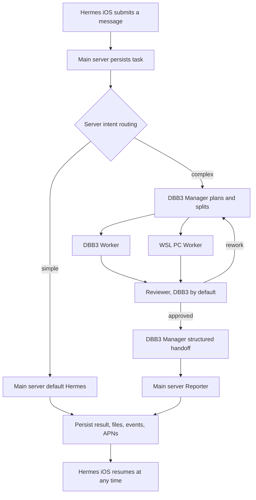

# Mobile-hosted collaboration architecture

## Runtime ownership

`given33/hermes-agent` is the official Hermes Agent history plus product-owned
server extensions. Hermes iOS is a native client; it does not embed a separate
agent runtime. The same approved `given33/hermes-agent` commit runs on the main
server, DBB3, and WSL so the product extensions and official capabilities stay
compatible.

The main server owns account authentication, durable conversations, task state,
append-only progress, files, notifications, and the final user-facing answer.
DBB3 and WSL are replaceable execution nodes. A phone disconnect never owns or
cancels a server task.

## Task flow

The DBB3 handoff contains the task objective, plan, worker results, reviewer
decision, rework history, file hashes, unresolved items, and a recommended
conclusion. The main server Reporter only summarizes verified handoff data. It
does not rerun the task or invent missing evidence.

## Durable state contract

The authoritative lifecycle is:

`accepted -> routing -> manager_planning -> dispatching -> worker_running -> reviewing -> rework -> manager_handoff -> reporting -> completed | failed | cancelled`

Every transition increments the conversation event cursor and is persisted
before the API acknowledges it. Hermes iOS loads an authoritative snapshot,
then resumes `/hosted-events` using the last cursor. SSE is primary; bounded
incremental polling is the fallback. Local mobile cache is never the authority.

If iOS exits, locks, loses network, or is killed, execution continues. If every
execution node is offline, the durable task pauses until a node reconnects. A
future main-server cloud worker may provide execution capacity during that
window without changing the persistence contract.

## WSL residency

WSL starts locally from Windows and does not depend on DBB3. Inside
`HermesUbuntu`, systemd runs the Hermes gateway and the `pc-cloud-connector`
user unit. Linger keeps the `hermes` user manager alive, service restart policy
recovers crashes, and the Windows scheduled task starts the distro after login.
The managed-node watchdog verifies health; it does not become the normal start
path.

## Upstream releases

The daily upstream workflow discovers the newest official tag and creates
`upstream-sync/<tag>`. It calculates direct fork overlap plus iOS/API and
deployment risk, merges only into that branch, runs product preflight, and opens
a pull request. The pull request runs the complete official CI matrix.

Codex review is mandatory. A conflict-free merge is not proof of product
compatibility. Changes affecting authentication, hosted conversations, MCP,
dashboard APIs, dependencies, or deployment must be reviewed explicitly. iOS
adaptations remain a product decision. Only an approved `main` commit may be
deployed transactionally to the main server, DBB3, and WSL.
